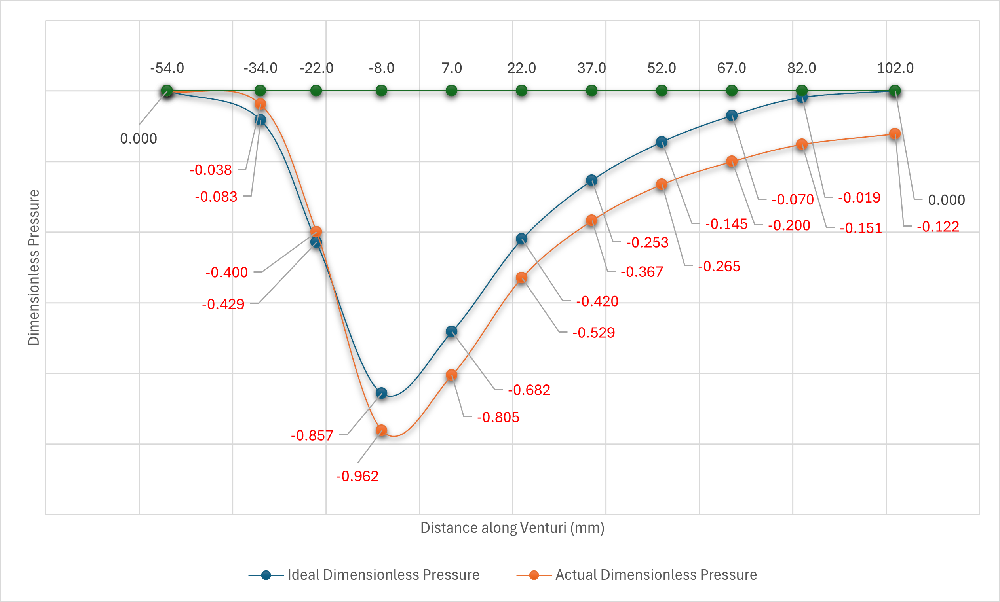

# 02. 열유체공학 — 냉난방 부하 계산



> **한 줄 소개(문제 중심)**: 건물 공조 설비 용량 산정을 위해 냉난방 부하를 ASHRAE 표준(CLTD)으로 항목별 산정하고, 열전달·유체 실험으로 이론값을 검증한 프로젝트.

### 📌 프로젝트 개요 (강의 템플릿)
| 항목 | 내용 |
|------|------|
| 문제 배경 | 공조 설비는 부하를 과소 산정하면 냉방 부족, 과대 산정하면 설비·에너지 과투자로 이어짐 |
| 해결 목표 | 외피·창·환기 등 다항목 냉방부하를 표준식으로 산정하고, 실험으로 물성·손실을 검증 |
| 기간 / 형태 | 2024-1 / 과목 과제 + 열전달·유체 실험 |
| 역할·기여 | 개인(계산표 작성) + 실험 팀(데이터 측정·회귀 분석) |
| 기술 스택 | ASHRAE CLTD 법, Excel, MATLAB 회귀, 열전도도·파이프 손실 실험 |
| 기술 선택 이유 | CLTD는 **벽체 축열에 의한 시간 지연**을 반영하는 표준 냉방부하법이라 채택 / 실험 산점도의 추세·물성 도출에는 2차 회귀가 적합 |

### 🧩 문제 → 영향 → 해결 → 결과
- **문제**: 지붕·벽·창(전도/일사)·환기(현열/잠열)를 동시에 고려한 냉방부하 산정
- **영향**: 항목 누락 시 설비 용량 오선정 → 쾌적성·운전비 직접 영향
- **해결**: CLTD 보정식 `CLTDcorr = CLTD + (25.5−tr) + (tm−29.4)` 으로 항목별 계산표 구성, 실험 원데이터를 회귀해 k·f 도출
- **결과(지표)**: 항목별 냉방부하 `Q[W]` 산출표 완성, 열전도도(푸리에 법칙)·파이프 마찰계수 f(Darcy-Weisbach)를 실측 회귀로 산정

### 💡 배운 점 · 향후 개선
- **배운 점**: 표준 계산(이론)과 실험(검증)을 연결하는 열유체 설계의 전체 흐름 이해
- **향후 개선**: 측정 불확도 정량화, CLTD 표 자동 매핑 스프레드시트화

---


> ASHRAE Fundamentals 기반 CLTD 법으로 건물의 냉방·난방 부하를 계산하고, AHU·FCU 시스템 설계까지 연계한 학습 기록입니다.

---

## 주요 학습·구현 항목

| # | 주제 | 핵심 내용 |
|---|------|-----------|
| 1 | 냉난방 부하 계산 수식 | 엑셀 기반 냉방/난방 부하 계산 수식 삽입 및 시각화 |
| 2 | 냉방부하 계산표 정리 | 이미지·PDF에서 계산표 복원 및 항목별 공식 정리 |
| 3 | 냉난방 부하 계산 표 | 복층 2단 표 형식으로 전체 항목 정리 (ASHRAE 출처 포함) |
| 4 | CLTD 기반 냉방부하 계산 | CLTD 보정식 엑셀 수식화, 전주 기준 설계 적용 |
| 5 | 외기 설계 조건 계산 | 전주 건구·습구 온도, 상대습도 도출 방법 |
| 6 | 냉공조 환기 부하 계산 | AHU·FCU 역할 분담, 외기 비율, 송풍량 도출 |

---

## 핵심 개념 정리

### 1. CLTD (Cooling Load Temperature Difference) 법

ASHRAE Fundamentals Chapter 18 기반 냉방 부하 계산 방법.

```
외부 지붕:   Q = U × A × CLTDcorr
외부 벽체:   Q = U × A × CLTDcorr
유리(전도):  Q = U × A × ΔT
유리(일사):  Q = SC × A × SCL
내부 발열:   Q_people + Q_lighting + Q_equipment
환기(외기):  Q = 1.2 × CFM × (to - ti)    [현열]
             Q = 3010 × CFM × (Wo - Wi)   [잠열]
```

#### CLTD 보정식

```
CLTDcorr = CLTD + (25.5 - tr) + (tm - 29.4)

  tr  : 실내 설계 온도 (°C)
  tm  : 외기 평균 온도 = 설계외기온도 - 일교차/2
  CLTD: 표 1-4, 1-8 참조값
```

---

### 2. 냉방부하 계산 항목 (전주 기준 예시)

| 항목 | 공식 | 변수 | 참조 |
|------|------|------|------|
| 외부 지붕 | Q = U·A·CLTDcorr | U=0.022 W/m²K | ASHRAE Ch.18 |
| 동측 외벽 | Q = U·A·CLTDcorr | A=116.6 m² | ASHRAE Ch.18 |
| 서측 외벽 | Q = U·A·CLTDcorr | A=75.6 m² | ASHRAE Ch.18 |
| 남측 외벽 | Q = U·A·CLTDcorr | A=116.6 m² | ASHRAE Ch.18 |
| 창문(전도) | Q = U·A·ΔT | U=5.8 W/m²K | ASHRAE Ch.18 |
| 창문(일사) | Q = SC·A·SCL | — | ASHRAE Table |
| 외기 현열 | Q = 1.2·CFM·ΔT | — | ASHRAE |
| 외기 잠열 | Q = 3010·CFM·ΔW | — | ASHRAE |

---

### 3. 외기 설계 조건 — 전주 기준

| 조건 | 여름 (냉방) | 겨울 (난방) |
|------|-------------|-------------|
| 건구 온도 (to) | 32°C (설계 외기) | -9°C |
| 습구 온도 | 25°C | — |
| 일교차 | 8~10°C | — |
| 평균 외기 (tm) | to - 일교차/2 | — |

> 상대습도는 건구·습구 온도에서 Psychrometric chart 또는 ASHRAE 습공기선도로 도출

---

### 4. AHU vs FCU 역할 분담

| 구분 | AHU (Air Handling Unit) | FCU (Fan Coil Unit) |
|------|--------------------------|----------------------|
| 위치 | 기계실 중앙 | 각 실 개별 설치 |
| 역할 | 외기 도입, 가열/냉각, 전체 환기 | 실별 세부 온도 조절 |
| 송풍 | 전체 덕트 시스템 | 각 실 직접 |
| 환기 비율 | 외기 비율 결정 | 실내 순환 위주 |

```
전체 냉방부하 = 실내부하 + 외기부하

외기 비율 = 외기부하 / 전체부하

총 송풍량(CFM) = Q_total / (1.1 × ΔT)
  → AHU 담당: 외기 환기량
  → FCU 담당: 나머지 실내 순환량
```

---

### 5. 엑셀 수식 구현 예시

```excel
=== 외부 지붕 냉방부하 ===
B10 = U값 (예: 0.022)
C10 = 면적 (예: 185)
D10 = CLTD 보정값 = E4 + (25.5 - F4) + (G4 - 29.4)
H10 = =B10*C10*D10   ← 냉방부하 [W]

=== CLTD 보정 ===
D4 = CLTD 표 참조값 (32)
E4 = =D4 + (25.5 - B4) + (C4 - 29.4)
```

---

## 🧪 열전달 · 유체 실험 (원본 보고서)

열유체 관련 학부 실험을 수행하고 데이터를 분석한 실험 보고서입니다. 위 냉난방 부하(열전달 이론)와 같은 맥락의 실험적 검증에 해당합니다.

### 실험 1 — 열전도도 측정

| 항목 | 내용 |
|------|------|
| 목적 | 시편을 통한 정상상태 열전도로 **열전도도(k)** 측정 |
| 원리 | 푸리에 법칙 `Q = -k·A·(dT/dx)` 기반, 온도 구배로 k 산출 |
| 산출물 | `열전달유체_실험/열전도도 실험 보고서.pdf`, 원데이터 `열전도_실험원데이터.xlsx` |

### 실험 2 — 파이프 에너지 손실

| 항목 | 내용 |
|------|------|
| 목적 | 관로 유동의 **마찰 손실(주손실)·부차 손실** 측정 |
| 원리 | 베르누이 + Darcy-Weisbach `h_L = f·(L/D)·(V²/2g)`, 마찰계수 f 도출 |
| 산출물 | `열전달유체_실험/파이프_에너지손실_실험자료.pdf`, 원데이터 `유체_실험원데이터.xlsx` |

### 데이터 분석

- 실험 원데이터(Excel)를 회귀분석해 그래프화(`실험데이터_2차회귀_비교그래프.m`).
- 보고서 양식(`보고서 양.png`, `파이프.png`)에 맞춰 결과 정리.

### 파일 안내

```
열전달유체_실험/
├─ 열전도도 실험 보고서.pdf / 열전도도_실험자료.pdf
├─ 파이프 에너지 손실 실험 보고서 양식.pdf / 파이프_에너지손실_실험자료.pdf
├─ 열전도_실험원데이터.xlsx / 유체_실험원데이터.xlsx / 광학실험파일_4조.xlsx
├─ 실험데이터_2차회귀_비교그래프.m
└─ 열역학*.png / 유체*.png        실험 그래프·측정 이미지
```

> 보고서 PDF·데이터 xlsx는 **Git LFS**로 추적됩니다.

