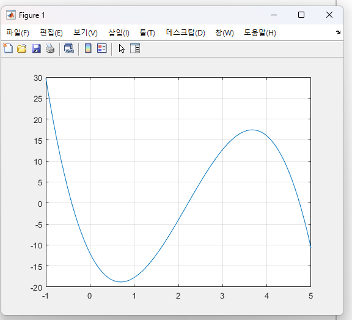

# 08. 수치해석 — MATLAB



> **한 줄 소개(문제 중심)**: 해석해를 구하기 어려운 공학 문제를, 수치 기법의 정확도·계산량 트레이드오프를 직접 비교해 적절한 방법을 선택할 수 있도록 구현한 프로젝트.

### 📌 프로젝트 개요 (강의 템플릿)
| 항목 | 내용 |
|------|------|
| 문제 배경 | 미분방정식·적분·보간 등은 해석해가 없거나 비쌀 때 수치 근사가 필요 |
| 해결 목표 | 대표 기법을 동일 문제에 적용·비교해 정확도와 비용의 트레이드오프 파악 |
| 기간 / 형태 | 2024-1 / 과목 과제(HW2·HW3) + 추가 구현 |
| 역할·기여 | 개인(전체 구현·보고서) |
| 기술 스택 | MATLAB (ODE 解法, 적분, 보간/회귀, 근 찾기) |
| 기술 선택 이유 | 행렬·그래프 처리와 빠른 프로토타이핑에 MATLAB이 적합 / 기법은 **차수(정확도) vs 계산량** 기준으로 선택 |

### 🧩 문제 → 영향 → 해결 → 결과
- **문제**: 동일 ODE/적분을 여러 기법으로 풀 때 정확도 차이를 정량 비교
- **영향**: 기법 선택이 해의 신뢰도·계산 비용을 좌우
- **해결**: 오일러·중점·RK4, 사다리꼴·심슨, 스플라인·회귀를 같은 입력으로 구현해 그래프로 대조
- **결과(지표)**: 같은 스텝 `h=0.5`에서 정확도 **오일러(1차) < 중점(2차) < RK4(4차)** 순으로 해석해에 수렴함을 확인

### 💡 배운 점 · 향후 개선
- **배운 점**: 차수가 오차에 미치는 영향, 기법별 적용 조건
- **향후 개선**: 스텝 크기-오차 수렴 곡선(log-log) 정량화, 적응 스텝(RKF45) 추가

### ▶ 실행 방법
```matlab
% MATLAB에서
run('원본/대표작/수치해석_ODE_오일러_중점_RK4_비교.m')
run('원본/대표작/수치해석_적분법_사다리꼴_심슨비교.m')
```

---


> 수치해석법 과목에서 상미분방정식(ODE) 解法, 수치적분, 보간·회귀, 비선형 방정식의 근 찾기를 MATLAB으로 구현하고 비교한 기록입니다. 과제(HW2·HW3) 보고서와 다수의 `.m` 스크립트가 포함되어 있습니다.

---

## 다룬 주제

| 구분 | 기법 | 대표 코드 |
|------|------|-----------|
| ODE 解法 | 오일러 / 중점(Midpoint) / 4차 Runge-Kutta | `수치해석_ODE_오일러_중점_RK4_비교.m` |
| ODE 해석해 비교 | 수치해 vs 해석해 오차 | `수치해석_ODE_해석해비교_오일러_중점_RK4.m` |
| 수치적분 | 사다리꼴 / 심슨 1/3 / 심슨 3/8 | `수치해석_적분법_사다리꼴_심슨비교.m` |
| 가우스 적분 | 3점 가우스 구적 | `수치해석_낙하속도_가우스적분_3점.m` |
| 보간 | 3차 스플라인, 보간점 함수값 | `수치해석_스플라인보간_그래프비교.m` |
| 회귀 | 선형·3차·비선형 회귀 비교 | `수치해석_선형3차_비선형회귀비교.m` |
| 근 찾기 | 이분법, False Position, Newton-Raphson, Wegstein | `원본/MATLAB 과제/Analysis/` |
| 최적화 | 황금분할(goldmin), 포물선 보간(ParabolicOpt) | `원본/MATLAB 과제/Analysis/` |

---

## 핵심 코드

### 1. ODE 解法 비교 — 오일러 / 중점 / RK4

미분방정식 `y' = y·t² − 1.1y`, `y(0)=1`, `h=0.5` 구간을 세 가지 방법으로 적분하고 비교.

```matlab
f = @(t, y) y*t^2 - 1.1*y;
t0 = 0; y0 = 1; h = 0.5; tf = 1;
t_values = t0:h:tf;

% Euler
for i = 1:length(t_values)-1
    y_euler(i+1) = y_euler(i) + h * f(t_values(i), y_euler(i));
end

% Midpoint
for i = 1:length(t_values)-1
    k1 = f(t_values(i), y_midpoint(i));
    k2 = f(t_values(i) + h/2, y_midpoint(i) + h/2 * k1);
    y_midpoint(i+1) = y_midpoint(i) + h * k2;
end

% 4th-order Runge-Kutta
for i = 1:length(t_values)-1
    k1 = f(t_values(i),       y_rk4(i));
    k2 = f(t_values(i) + h/2, y_rk4(i) + h/2 * k1);
    k3 = f(t_values(i) + h/2, y_rk4(i) + h/2 * k2);
    k4 = f(t_values(i) + h,   y_rk4(i) + h   * k3);
    y_rk4(i+1) = y_rk4(i) + h/6 * (k1 + 2*k2 + 2*k3 + k4);
end
```

→ 차수가 높을수록(오일러 < 중점 < RK4) 같은 스텝에서 해석해에 더 가까움을 그래프로 확인.

### 2. 수치적분 비교 — 사다리꼴 / 심슨

`f(x)=sin(x)`를 `[0, π]`에서 적분하며 각 기법의 분점 배치를 시각화.

```matlab
f = @(x) sin(x);
a = 0; b = pi; n = 4;
h = (b - a) / n;
x_points = a:h:b;

% 사다리꼴: 각 구간을 사다리꼴로 근사 (fill)
% 심슨 1/3: a:h/2:b 분점
% 심슨 3/8: a:h/3:b 분점
```

→ 같은 구간에서 심슨법이 사다리꼴보다 곡선을 더 정확히 근사.

---

## 과제 보고서

| 파일 | 내용 |
|------|------|
| `원본/대표작/수치해석법_HW2_..._NohGyeongCheon.pdf` | 보간·회귀 과제 보고서 |
| `원본/대표작/수치해석법_HW3_..._NohGyeongCheon.pdf` | ODE·적분 과제 보고서 |

---

## 배운 점

- 수치 기법의 **차수(order)와 오차**의 관계를 직접 구현·비교하며 체감.
- 동일 문제를 여러 기법으로 풀어 **정확도 vs 계산량** 트레이드오프를 이해.
- 근 찾기/최적화(이분법·뉴턴랩슨·황금분할 등)를 함수 단위로 모듈화하는 연습.

---

## 파일 안내

```
원본/
├─ 대표작/                  ODE·적분 대표 스크립트 + HW2·HW3 보고서(PDF)
├─ MATLAB 과제/             HW21~HW33, Quiz2, RK4.m 등 과제 코드
│   └─ Analysis/            이분법·뉴턴랩슨·황금분할 등 근/최적화 코드
└─ 보간·회귀 추가코드/        스플라인·회귀 추가 구현
```
