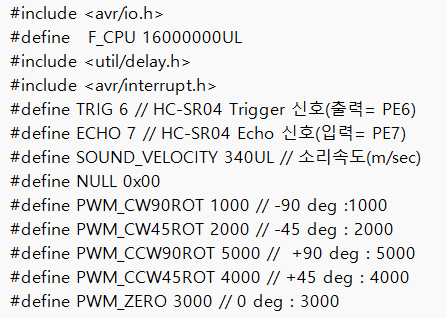

# 10. 메카트로닉스 — ATmega128 센서 제어



> **한 줄 소개(문제 중심)**: 컵에 담긴 액체량을 사람이 눈대중하는 문제를, 초음파·조도 센서 융합으로 채움 비율(%)을 자동 측정·표시하는 임베디드 시스템으로 해결.

### 📌 프로젝트 개요 (강의 템플릿)
| 항목 | 내용 |
|------|------|
| 문제 배경 | 액체 채움 정도를 정량·자동으로 측정·표시할 저비용 수단 필요 |
| 해결 목표 | 컵 위 액면까지 거리 → 채움 비율(%) 환산 → CLCD 실시간 표시 |
| 기간 / 형태 | 2024-1 / 메카트로닉스 대표 프로젝트(팀) |
| 역할·기여 | 센서·제어 코드(초음파 거리측정·ADC·CLCD·인터럽트) 구현 |
| 기술 스택 | ATmega128(AVR-C), HC-SR04 초음파, CdS 조도, CLCD, 외부 인터럽트, Timer1 |
| 기술 선택 이유 | **비접촉·저비용** 거리 측정에 초음파(HC-SR04)가 적합 / 컵 유무 감지는 조도(CdS)로 단순화 / 정확한 왕복시간 측정을 위해 Timer1 입력 캡처 사용 |

### 🧩 문제 → 영향 → 해결 → 결과
- **문제**: 액면 거리를 안정적으로 측정해 비율로 환산하고, 측정 트리거를 자동화
- **영향**: 노이즈·오측정 시 표시값이 튀어 신뢰도 저하
- **해결**: Timer1로 초음파 왕복시간 측정 → 거리→비율 환산, CdS 임계값으로 측정 시작, 인터럽트로 연속/홀드 전환
- **결과(지표)**: CLCD에 `RATIO 000.0 %` 포맷(**0.1% 분해능**)으로 실시간 출력, 발표·시연영상·완성 펌웨어로 동작 입증

### 💡 배운 점 · 향후 개선
- **배운 점**: 레지스터 직접 제어(ADC/Timer/인터럽트), 다중 센서 융합 설계
- **향후 개선**: 이동평균 필터로 측정 안정화, 온도 보정으로 음속 오차 감소

---


> ATmega128(AVR) 마이크로컨트롤러를 직접 레지스터 수준에서 제어한 메카트로닉스 프로젝트 모음입니다. 대표작은 **컵 비율 측정기**이며, 인터럽트 기반 **엘리베이터 제어**, 각종 FND·CLCD·센서 실습 코드와 발표자료·시연영상을 포함합니다.

---

## 🏆 대표작 — 컵 비율 측정기 (Cup Ratio Meter)

컵에 담긴 액체의 채움 비율(%)을 측정해 CLCD에 표시하는 시스템.

### 동작 개념

```
[조도센서(CdS)]  컵이 놓였는지(주변 밝기) 감지 → 측정 트리거
        │
        ▼
[초음파(HC-SR04)] 컵 위 액면까지 거리 측정 → 빈 높이 환산
        │
        ▼
   비율(%) = (기준높이 − 측정높이) / 기준높이 × 100
        │
        ▼
[CLCD 16x2]  "RATIO : 000.0 %" 표시
[스위치 인터럽트]  연속 측정 / 홀드 상태 전환
```

### 하드웨어 / 포트 매핑

| 기능 | 소자 | ATmega128 포트 |
|------|------|----------------|
| 거리 측정 | HC-SR04 (TRIG/ECHO) | PE6 / PE7, Timer1 캡처 |
| 밝기 감지 | CdS + ADC | PORTF (ADC0) |
| 표시 | CLCD (4-bit 모드) | PORTC(data), PORTD(RS/RW/E) |
| 상태 전환 | 스위치 외부 인터럽트 | INT4 (PE4, 하강에지) |

### 핵심 코드 — 초음파 거리 측정 (Timer1)

```c
int read_distance() {
    TCCR1B = 0x03;                 // Timer1 클록 4us
    PORTE |= (1<<TRIG); _delay_us(10); PORTE &= ~(1<<TRIG);   // 10us 트리거 펄스
    while(!(PINE & (1<<ECHO)));     // Echo HIGH 대기
    TCNT1 = 0x0000;                 // 카운터 리셋
    while(PINE & (1<<ECHO));        // Echo HIGH 동안 카운트
    TCCR1B = 0x00;                  // 클록 정지
    distance = (SOUND_VELOCITY * (TCNT1 * 4 / 2)) / 1000;  // 거리 = 속도×시간/2
    ...
}
```

> 음속(340 m/s)과 Timer1 카운트로 왕복 시간을 거리로 환산하고, 기준 높이 대비 비율을 계산해 CLCD에 `000.0 %` 포맷으로 출력. ADC로 읽은 조도값이 임계치 이하일 때만 측정 루프를 실행.

### 산출물

| 파일 | 내용 |
|------|------|
| `원본/대표작/컵비율측정_제어코드_완성본.txt` | 최종 펌웨어 (AVR-C) |
| `원본/대표작/컵비율측정_발표자료.pptx` | 프로젝트 발표자료 |
| `원본/대표작/컵비율측정_시연영상_01.mp4` | 동작 시연 영상 |
| `원본/대표작/컵비율측정_프로젝트사진_01.jpg` | 제작 사진 |
| `원본/수업자료·과제텍스트/컵비율측정_프로젝트/` | 단계별 코드(초음파·CdS·CLCD), 현장사진 다수 |

---

## 그 외 제어 실습

### 엘리베이터 FND 제어 (인터럽트 기반 상태머신)
- 두 개의 외부 인터럽트(INT4/INT5)로 **상승/하강/정지/방향전환** 상태를 전환.
- FND에 현재 층수(부호 포함, 지하층은 'd' 표시)와 이동 방향(U/d)을 표시.
- 스위치 바운스를 `_delay_ms` + 재검사로 디바운싱.
- 파일: `원본/수업자료·과제텍스트/` 및 [02 열유체 폴더의 실험 자료와 연계 코드]

### 기타 실습 코드 (수업·과제)
FND, CLCD, UART, 광센서, 모터, 부저, 스톱워치 등 주차별 실습 코드와 시연 영상 다수.
- `원본/수업자료·과제텍스트/메카트로닉스 HW/` — LED·SW·SENSOR·MOTOR·UART·BUZZ 실습(`.txt` 코드 + `.mp4`)

---

## 배운 점

- **레지스터 직접 제어**(DDR/PORT/PIN, ADC, Timer, 외부 인터럽트)로 MCU 동작 원리를 이해.
- 초음파·조도 등 **다중 센서 융합**으로 의미 있는 물리량(비율)을 산출하는 설계 경험.
- 인터럽트 + 상태머신으로 **이벤트 기반 제어** 로직을 구성.

---

## 파일 안내

```
원본/
├─ 대표작/                       컵 비율 측정기 핵심 산출물
├─ 발표자료·실습이미지/            발표 이미지·실습 영상
└─ 수업자료·과제텍스트/            주차별 실습 코드·과제·데이터시트
    ├─ 메카트로닉스 HW/            실습 코드 + 시연 영상
    └─ 컵비율측정_프로젝트/         단계별 코드·현장 사진
```
