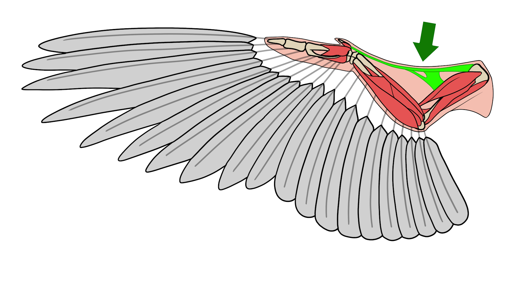

# 11. 기계설계 — Ornithopter (날갯짓 비행체)



> **한 줄 소개(문제 중심)**: 새의 날갯짓을 기계 기구로 재현하기 위해, 생체 구조를 분석·추상화하여 SolidWorks로 모델링하고 다축 서보로 구동한 팀 설계 프로젝트.

### 📌 프로젝트 개요 (강의 템플릿)
| 항목 | 내용 |
|------|------|
| 문제 배경 | 고정익과 달리 날갯짓(flapping) 운동을 단순·경량 기구로 구현하기 어려움 |
| 해결 목표 | 생체 모방 기반 날개 기구 설계 + 서보로 날갯짓 시퀀스 구현 |
| 기간 / 형태 | 2024-2 / 기계설계 팀 프로젝트 |
| 역할·기여 | 생체 구조 분석, 날개 파트 모델링, 서보 구동 코드 |
| 기술 스택 | SolidWorks(곡면 파트·어셈블리), Arduino + Servo |
| 기술 선택 이유 | 곡면 날개 형상엔 SolidWorks 서피스 모델링이 적합 / 동작 시에만 `attach`하고 끝나면 `detach`해 **떨림·전력 소모 감소** |

### 🧩 문제 → 영향 → 해결 → 결과
- **문제**: 새 날개의 굽힘·접힘 운동을 기계 기구로 단순화
- **영향**: 과도하게 복잡하면 무게·고장 증가로 비행 성립 곤란
- **해결**: 깃털·근육 구조 분석 → 곡면 날개 파트 모델링 → 5축 서보 순차 구동(0°↔90°)으로 flapping 생성
- **결과**: 날개 어셈블리 모델 + 5축 순차 구동 동작 구현, 팀 기획·결과 보고서로 설계 흐름 문서화

### 💡 배운 점 · 향후 개선
- **배운 점**: 생체 구조의 기계적 추상화, 다축 서보 동기 제어
- **향후 개선**: 링크 기구(4절)로 서보 수 절감, 날개 재질·면적 변수에 따른 추력 정량 측정

---


> 기계설계 과목 팀 프로젝트. 새의 날갯짓(flapping) 메커니즘을 모사한 **오니솝터**를 주제로, 생체 모방 분석 → SolidWorks 날개/기구 모델링 → 서보모터 구동 코드까지 수행했습니다.

---

## 프로젝트 개요

| 단계 | 내용 |
|------|------|
| 생체 모방 분석 | 새의 날개·근육 구조 분석(깃털·근육 모식도) → 날갯짓 운동 모델링 |
| 기구 설계 | 날개 파트(`wingpart.SLDPRT`) 및 어셈블리 모델링 (SolidWorks) |
| 구동 | 다중 서보모터로 날개 섹션을 순차 구동(flapping 시퀀스) |
| 문서화 | 팀 프로젝트 기획서·결과 보고서(PDF) |

---

## 구동 코드 — 5개 서보 순차 제어 (Arduino)

각 날개 섹션을 담당하는 5개 서보를 0°↔90°로 왕복시켜 날갯짓 동작을 생성. 동작 시에만 `attach`하고 끝나면 `detach`하여 떨림(jitter)과 전력 소모를 줄이는 방식.

```cpp
#include <Servo.h>
#define servoPin1 3
... // servoPin2~5 = 5,6,9,10
Servo servo1; ... Servo servo5;

void servo1_OFF() {                 // 0° → 90°
  servo1.attach(servoPin1);
  for (int angle = 0; angle <= 90; angle++) { servo1.write(angle); delay(10); }
  servo1.detach();
}
void servo1_ON()  {                 // 90° → 0°
  servo1.attach(servoPin1);
  for (int angle = 90; angle >= 0; angle--) { servo1.write(angle); delay(10); }
  servo1.detach();
}
// loop(): servo1~5를 1초 간격으로 OFF→ON 순차 구동
```

---

## 산출물

| 파일 | 내용 |
|------|------|
| `원본/대표작/Ornithopter_대표어셈블리.SLDASM` | 대표 어셈블리 모델 |
| `원본/대표작/chpt0-Team_project-birds_2024.pdf` | 팀 프로젝트 기획/발표 자료 |
| `원본/대표작/기소설계2_프로젝트(1).pdf` | 기계설계 프로젝트 보고서 |
| `원본/Ornithopter 설계모델/wingpart.SLDPRT`, `wingpart1.SLDPRT` | 날개 파트 모델 |
| `원본/Ornithopter 설계모델/#include Servo.h.txt` | 5축 서보 구동 코드 |
| `원본/Ornithopter 설계모델/깃털과 근육.png`, `새 날개 근육.jpg` | 생체 모방 분석 자료 |

---

## 배운 점

- 생체 구조를 기계 기구로 **추상화·단순화**하는 설계적 사고.
- SolidWorks로 곡면 날개 파트를 모델링하고 어셈블리 구속을 부여하는 경험.
- 서보 `attach/detach` 제어로 다축 동기 동작을 안정적으로 구현.
